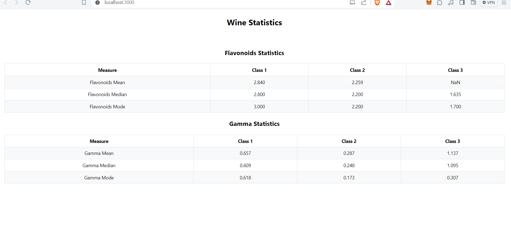
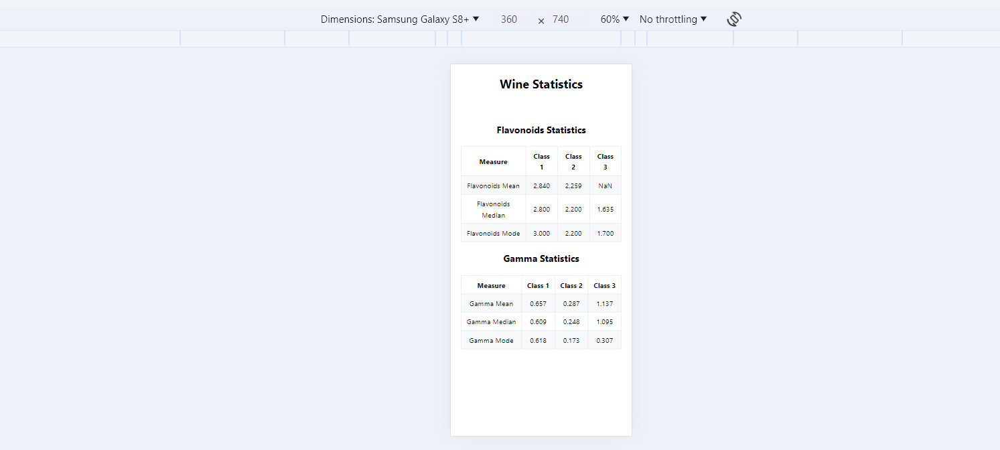
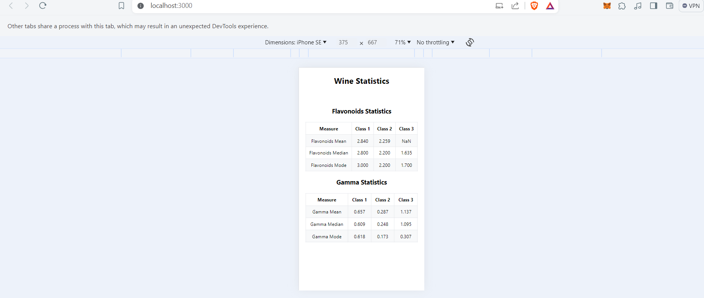

## Wine Statistics 

Demo Link: https://manufac-analytics-theta.vercel.app/

## Snippets

## Tech Stacks
  React, Javascript, Yarn, Mantine

## Description 

 This assignment deals with logic/calculation of Mean, Median and Mode without making use of 3rd party library. 

 This project feature two tables that represents the calculation of Flavonoid and gamma functions for the entire dataset.

 As it was asked the “Class” of alcohol needs to be denoted by the “Alcohol” property. 

 Also “Gamma” for each point of the dataset calculated as Gamma = (Ash * Hue) / Magnesium. Thereafter, calculated the class-wise mean, median, mode of “Gamma” for the entire dataset.

 A separate file has been added in utils folder for stats calculation just for the ease of understanding the logic.

 
 All these data are reperented in table format by making use of Mantine package.

 It is reponsive for all the views.